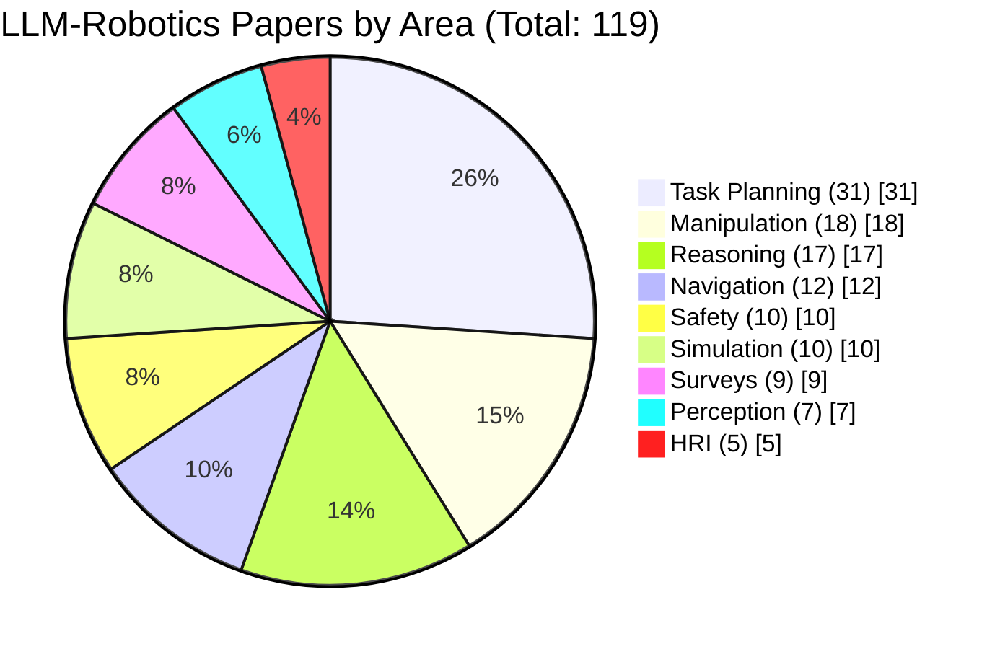

# LLM-Robotics: Complete Literature Review

A comprehensive curative list of **papers using Large Language/Multi-Modal Models for Robotics/RL**. This document combines an extensive paper list with detailed explanations of key works.

---

## Table of Contents

- [Introduction: Why Use LLMs in Robots?](#introduction-why-use-llms-in-robots)
- [Paper Distribution by Research Area](#paper-distribution-by-research-area)
- [Surveys](#surveys)
- [Task Planning and Decomposition](#task-planning-and-decomposition)
- [Reasoning](#reasoning)
- [Planning](#planning)
- [Spatial Reasoning and Navigation](#spatial-reasoning-and-navigation)
- [Object Manipulation and Grasping](#object-manipulation-and-grasping)
- [Human-Robot Interaction](#human-robot-interaction)
- [Scene Understanding and Perception](#scene-understanding-and-perception)
- [Safety, Risks, and Evaluation](#safety-risks-and-evaluation)
- [Simulation Frameworks](#simulation-frameworks)
- [Key Challenges and Limitations](#key-challenges-and-limitations)
- [Future Directions](#future-directions)
- [Complete Reference Table with DOIs](#complete-reference-table-with-dois)
- [Citation](#citation)

---

## Introduction: Why Use LLMs in Robots?

Traditional robots need to be programmed with exact instructions for every situation. This is hard because the real world is unpredictable. By connecting an LLM to a robot, the robot can:

- **Understand commands in natural language** (like "bring me something to drink")
- **Use common sense knowledge** (knowing that a fridge usually contains drinks)
- **Break down big tasks into smaller steps**
- **Explain what it's doing and why**

### The Basic Architecture

Most LLM-robot systems work like this:

1. **Human speaks**: "Clean up the kitchen table"
2. **LLM thinks**: Breaks this into steps: find objects, pick them up, put them away
3. **Robot acts**: Executes each step using its cameras and arms
4. **Feedback loop**: If something goes wrong, the LLM replans

---

## Paper Distribution by Research Area

**Total Papers: 119**

| Area | Papers | % |
|------|--------|---|
| **Task Planning & Decomposition** | **31** | **26.1%** |
| Object Manipulation & Grasping | 18 | 15.1% |
| Reasoning | 17 | 14.3% |
| Spatial Reasoning & Navigation | 12 | 10.1% |
| Safety, Risks & Evaluation | 10 | 8.4% |
| Simulation Frameworks | 10 | 8.4% |
| Surveys | 9 | 7.6% |
| Scene Understanding & Perception | 7 | 5.9% |
| Human-Robot Interaction | 5 | 4.2% |

> **Key Finding:** Task Planning dominates LLM-Robotics research with 26.1% of papers, demonstrating that LLMs excel at decomposing high-level goals into actionable robot commands.

---

## Surveys

| Paper | Venue/Date | Links |
|-------|------------|-------|
| A Survey of Robotic Language Grounding: Tradeoffs between Symbols and Embeddings | IJCAI, Aug 2024 | [[Paper]](https://arxiv.org/abs/2405.13245) |
| A Superalignment Framework in Autonomous Driving with Large Language Models | arXiv, Jun 2024 | [[Paper]](https://arxiv.org/abs/2406.05651) |
| Neural Scaling Laws for Embodied AI | arXiv, May 2024 | [[Paper]](https://arxiv.org/abs/2405.14005) |
| On the Prospects of Incorporating Large Language Models in Automated Planning and Scheduling | ICAPS, May 2024 | [[Paper]](https://ojs.aaai.org/index.php/ICAPS/article/view/31503) [[Website]](https://ai4society.github.io/LLM-Planning-Viz/) |
| Toward General-Purpose Robots via Foundation Models: A Survey and Meta-Analysis | arXiv, Dec 2023 | [[Paper]](https://arxiv.org/abs/2312.08782) [[Website]](https://robotics-fm-survey.github.io/) |
| Language-conditioned Learning for Robotic Manipulation: A Survey | arXiv, Dec 2023 | [[Paper]](https://arxiv.org/abs/2312.10807) |
| Foundation Models in Robotics: Applications, Challenges, and the Future | arXiv, Dec 2023 | [[Paper]](https://arxiv.org/abs/2312.07843) |
| Robot Learning in the Era of Foundation Models: A Survey | arXiv, Nov 2023 | [[Paper]](https://arxiv.org/abs/2311.14379) |
| The Development of LLMs for Embodied Navigation | arXiv, Nov 2023 | [[Paper]](https://arxiv.org/abs/2311.00530) |

---

## Task Planning and Decomposition

Task planning means figuring out HOW to do something. When you ask a robot to "make breakfast," it needs to plan: first get eggs, then heat the pan, then crack eggs, etc. LLMs are very good at this because they know about everyday activities from the text they learned from.

### SayCan (Google, 2022)

**Paper**: "Do As I Can, Not As I Say: Grounding Language in Robotic Affordances"

**Simple Explanation**: Imagine you ask your robot "I'm hungry." The robot needs to figure out what it CAN actually do to help. SayCan combines what the LLM SUGGESTS (like "bring food from the kitchen") with what the robot can ACTUALLY DO (its "affordances"). If the robot can't reach the top shelf, SayCan won't suggest getting food from there, even if the LLM thinks that's where the food is. It's like having a smart friend who gives advice but checks first if you can actually follow it.

**Why It's Important**: This was the first major paper showing that LLMs can work with real robots by checking what's physically possible.

| Links | arXiv: 2204.01691 | DOI: 10.48550/arXiv.2204.01691 |
|-------|-------------------|-------------------------------|
| [[Paper]](https://arxiv.org/abs/2204.01691) | [[Colab]](https://say-can.github.io/#open-source) | [[Website]](https://say-can.github.io/) |

---

### Code-as-Policies (Google, 2022)

**Paper**: "Code as Policies: Language Model Programs for Embodied Control"

**Simple Explanation**: Instead of the LLM just saying what to do in words, this paper has the LLM write actual computer code (Python) that controls the robot. So when you say "move in a circle," the LLM writes code like: `for angle in range(360): move_forward(0.1); turn(1)`. This is more precise than just giving instructions in English. It's like the difference between telling someone "draw a square" versus giving them exact coordinates.

**Why It's Important**: Writing code is more precise and can handle complex math and logic that simple language instructions can't.

| Links | arXiv: 2209.07753 | DOI: 10.48550/arXiv.2209.07753 |
|-------|-------------------|-------------------------------|
| [[Paper]](https://arxiv.org/abs/2209.07753) | [[Colab]](https://github.com/google-research/google-research/tree/master/code_as_policies) | [[Website]](https://code-as-policies.github.io/) |

---

### Inner Monologue (Google, 2022)

**Paper**: "Inner Monologue: Embodied Reasoning through Planning with Language Models"

**Simple Explanation**: This paper gives the robot an "inner voice" - it talks to itself! When the robot tries to pick up a cup but fails, it gets feedback: "gripper empty, cup still on table." The LLM then reasons: "I missed the cup, let me try again but position my arm differently." It's like how you might talk through a problem out loud: "Okay, that didn't work, what if I try this instead?"

**Why It's Important**: Robots make mistakes. This paper shows how LLMs can use feedback to recover from errors.

| Links | arXiv: 2207.05608 | DOI: 10.48550/arXiv.2207.05608 |
|-------|-------------------|-------------------------------|
| [[Paper]](https://arxiv.org/abs/2207.05608) | [[Website]](https://innermonologue.github.io/) |

---

### ReAct (Princeton/Google, 2022)

**Paper**: "ReAct: Synergizing Reasoning and Acting in Language Models"

**Simple Explanation**: ReAct makes the LLM alternate between THINKING and ACTING. Think: "I need to find the remote." Act: Look around the room. Think: "I see the sofa, remotes are often near sofas." Act: Go to the sofa. This back-and-forth helps the robot stay on track because it keeps checking its reasoning against what it sees in the real world.

**Why It's Important**: This prevents the robot from making a wrong plan and blindly following it - it keeps checking reality.

| Links | arXiv: 2210.03629 | DOI: 10.48550/arXiv.2210.03629 |
|-------|-------------------|-------------------------------|
| [[Paper]](https://arxiv.org/abs/2210.03629) | [[Github]](https://github.com/ysymyth/ReAct) | [[Website]](https://react-lm.github.io/) |

---

### LLM-Planner (Ohio State, 2022)

**Paper**: "LLM-Planner: Few-Shot Grounded Planning for Embodied Agents with Large Language Models"

**Simple Explanation**: Most robot systems need thousands of examples to learn. LLM-Planner needs very few (that's what "few-shot" means). You show it just 3-5 examples of tasks, and it can plan new tasks it has never seen. It also updates its plan when things change - if a door is suddenly closed, it replans to find another path. Think of it as a quick learner who adapts on the fly.

**Why It's Important**: Robots need to work in new environments without tons of training examples.

| Links | arXiv: 2212.04088 | DOI: 10.48550/arXiv.2212.04088 |
|-------|-------------------|-------------------------------|
| [[Paper]](https://arxiv.org/abs/2212.04088) | [[Pytorch Code]](https://github.com/OSU-NLP-Group/LLM-Planner/) | [[Website]](https://dki-lab.github.io/LLM-Planner/) |

---

### ProgPrompt (NVIDIA/Cornell, 2022)

**Paper**: "ProgPrompt: Generating Situated Robot Task Plans using Large Language Models"

**Simple Explanation**: This paper creates a special way to talk to the LLM using programming-style prompts. You tell it what actions the robot can do (like `grab()`, `move()`, `place()`) and what objects exist in the room. Then the LLM generates a plan using only these available actions. It's like giving someone a list of Lego pieces they have and asking them to build something - they'll only use the pieces available.

**Why It's Important**: Makes sure the LLM only suggests actions the robot can actually perform.

| Links | arXiv: 2209.11302 | DOI: 10.48550/arXiv.2209.11302 |
|-------|-------------------|-------------------------------|
| [[Paper]](https://arxiv.org/abs/2209.11302) | [[Github]](https://github.com/progprompt/progprompt) | [[Website]](https://progprompt.github.io/) |

---

### VOYAGER (NVIDIA/Caltech, 2023)

**Paper**: "Voyager: An Open-Ended Embodied Agent with Large Language Models"

**Simple Explanation**: VOYAGER is a Minecraft AI that learns forever (that's "lifelong learning"). It plays the game, learns new skills, saves them in a "skill library," and builds on them. First it learns to chop wood, then craft tools, then build houses. Each new skill uses the old ones. It never stops learning and improving. Think of it as building a personal library of abilities.

**Why It's Important**: Shows how robots can keep learning and improving without limits.

| Links | arXiv: 2305.16291 | DOI: 10.48550/arXiv.2305.16291 |
|-------|-------------------|-------------------------------|
| [[Paper]](https://arxiv.org/abs/2305.16291) | [[Pytorch Code]](https://github.com/MineDojo/Voyager) | [[Website]](https://voyager.minedojo.org/) |

---

### Language Models as Zero-Shot Planners (Berkeley, 2022)

**Paper**: "Language Models as Zero-Shot Planners: Extracting Actionable Knowledge for Embodied Agents"

**Simple Explanation**: "Zero-shot" means the robot plans without ANY examples for that specific task. If you say "make coffee," it plans the steps even if it has never been taught about making coffee specifically. The LLM already knows about coffee-making from all the text it read. This paper discovered that big LLMs contain useful knowledge about everyday tasks without needing extra training.

**Why It's Important**: This foundational paper showed that LLMs already know how to do many tasks - we just need to extract that knowledge.

| Links | arXiv: 2201.07207 | DOI: 10.48550/arXiv.2201.07207 |
|-------|-------------------|-------------------------------|
| [[Paper]](https://arxiv.org/abs/2201.07207) | [[Pytorch Code]](https://github.com/huangwl18/language-planner) | [[Website]](https://wenlong.page/language-planner/) |

---

### SayPlan (Queensland, 2023)

**Paper**: "SayPlan: Grounding Large Language Models using 3D Scene Graphs for Scalable Task Planning"

**Simple Explanation**: SayPlan works in HUGE buildings with many floors and rooms. It uses a "scene graph" - a map showing all objects and rooms and how they're connected. The LLM can search this map to find things. If you say "get me a snack," it searches the graph: "Snacks are usually in kitchens. Kitchen is on floor 2. I need to take elevator, go to kitchen, find snack cabinet." Works in offices, hospitals, big buildings.

**Why It's Important**: Makes LLM planning work in large, complex environments, not just small rooms.

| Links | arXiv: 2307.06135 | DOI: 10.48550/arXiv.2307.06135 |
|-------|-------------------|-------------------------------|
| [[Paper]](https://arxiv.org/abs/2307.06135) | [[Website]](https://sayplan.github.io/) |

---

## Reasoning

| Paper | Venue/Date | Links |
|-------|------------|-------|
| **RoboRefer**: Towards Spatial Referring with Reasoning in Vision-Language Models for Robotics | arXiv, June 2025 | [[Paper]](https://arxiv.org/abs/2506.04308) [[Code]](https://github.com/Zhoues/RoboRefer) [[Website]](https://zhoues.github.io/RoboRefer/) |
| **RoboSpatial**: Teaching Spatial Understanding to 2D and 3D Vision-Language Models for Robotics | CVPR, June 2025 | [[Paper]](https://arxiv.org/abs/2411.16537) [[Code]](https://github.com/NVlabs/RoboSpatial) [[Website]](https://chanh.ee/RoboSpatial/) |
| **RobotxR1**: Enabling Embodied Robotic Intelligence on Large Language Models through Closed-Loop RL | arXiv, May 2025 | [[Paper]](https://arxiv.org/abs/2505.03238) |
| **SPINE**: Online Semantic Planning for Missions with Incomplete Natural Language Specifications | ICRA, May 2025 | [[Paper]](https://arxiv.org/abs/2410.03035) [[Website]](https://zacravichandran.github.io/SPINE/) |
| **ELLMER**: Embodied LLMs enable robots to complete long-horizon tasks in unpredictable settings | Nature MI, Mar 2025 | [[Paper]](https://www.nature.com/articles/s42256-025-01005-x) |
| **AHA**: A Vision-Language-Model for Detecting and Reasoning over Failures in Robotic Manipulation | arXiv, Oct 2024 | [[Paper]](https://arxiv.org/abs/2410.00371) [[Website]](https://aha-vlm.github.io/) |
| **ReKep**: Spatio-Temporal Reasoning of Relational Keypoint Constraints for Robotic Manipulation | arXiv, Sep 2024 | [[Paper]](https://arxiv.org/abs/2409.01652) [[Code]](https://github.com/huangwl18/ReKep) [[Website]](https://rekep-robot.github.io) |
| **Octopi**: Object Property Reasoning with Large Tactile-Language Models | RSS, June 2024 | [[Paper]](https://arxiv.org/abs/2405.02794) [[Code]](https://github.com/clear-nus/octopi) [[Website]](https://octopi-tactile-lvlm.github.io/) |
| **MoMa-LLM**: Language-Grounded Dynamic Scene Graphs for Interactive Object Search | arXiv, Mar 2024 | [[Paper]](https://arxiv.org/abs/2403.08605) [[Code]](https://github.com/robot-learning-freiburg/MoMa-LLM) [[Website]](http://moma-llm.cs.uni-freiburg.de/) |
| **AutoRT**: Embodied Foundation Models for Large Scale Orchestration of Robotic Agents | arXiv, Jan 2024 | [[Paper]](https://arxiv.org/abs/2401.12963) [[Website]](https://auto-rt.github.io/) |
| **LEO**: An Embodied Generalist Agent in 3D World | arXiv, Nov 2023 | [[Paper]](https://arxiv.org/abs/2311.12871) [[Code]](https://github.com/embodied-generalist/embodied-generalist) [[Website]](https://embodied-generalist.github.io/) |
| **LLM-State**: Open World State Representation for Long-horizon Task Planning | arXiv, Nov 2023 | [[Paper]](https://arxiv.org/abs/2311.17406) |
| **Robogen**: A generative and self-guided robotic agent that endlessly proposes and masters new skills | arXiv, Nov 2023 | [[Paper]](https://arxiv.org/abs/2311.01455) [[Code]](https://github.com/Genesis-Embodied-AI/RoboGen) [[Website]](https://robogen-ai.github.io/) |
| **LLaRP**: Large Language Models as Generalizable Policies for Embodied Tasks | arXiv, Oct 2023 | [[Paper]](https://arxiv.org/abs/2310.17722) [[Website]](https://llm-rl.github.io) |
| **Instruct2Act**: Mapping Multi-modality Instructions to Robotic Actions with LLMs | arXiv, May 2023 | [[Paper]](https://arxiv.org/abs/2305.11176) [[Pytorch Code]](https://github.com/OpenGVLab/Instruct2Act) |
| **Generative Agents**: Interactive Simulacra of Human Behavior | arXiv, Apr 2023 | [[Paper]](https://arxiv.org/abs/2304.03442v1) [[Code]](https://github.com/joonspk-research/generative_agents) |
| **Matcha**: Interactive Multimodal Perception using Large Language Models | IROS, Mar 2023 | [[Paper]](https://arxiv.org/abs/2303.08268) [[Github]](https://github.com/xf-zhao/Matcha) [[Website]](https://matcha-model.github.io/) |
| **Socratic Models**: Composing Zero-Shot Multimodal Reasoning with Language | arXiv, Apr 2021 | [[Paper]](https://arxiv.org/abs/2204.00598) [[Website]](https://socraticmodels.github.io/) |

---

## Planning

| Paper | Venue/Date | Links |
|-------|------------|-------|
| **FLARE**: Multi-Modal Grounded Planning and Efficient Replanning for Embodied Agents | AAAI, Mar 2025 | [[Paper]](https://arxiv.org/abs/2412.17288) [[Code]](https://github.com/snumprlab/flare) |
| **LLM+MAP**: Bimanual Robot Task Planning using LLMs and PDDL | arXiv, Mar 2025 | [[Paper]](https://arxiv.org/abs/2503.17309) [[Code]](https://github.com/Kchu/LLM-MAP) |
| **Code-as-Monitor**: Constraint-aware Visual Programming for Reactive Robotic Failure Detection | CVPR, 2025 | [[Paper]](https://arxiv.org/abs/2412.04455) [[Project]](https://zhoues.github.io/Code-as-Monitor/) |
| **LABOR Agent**: Large Language Models for Orchestrating Bimanual Robots | Humanoids, Nov 2024 | [[Paper]](https://arxiv.org/abs/2404.02018) [[Website]](https://labor-agent.github.io/) [[Code]](https://github.com/Kchu/LABOR-Agent) |
| **PRED**: Pre-emptive Action Revision by Environmental Feedback | CoRL, Sept 2024 | [[Paper]](https://openreview.net/pdf?id=cq2uB30uBM) [[Code]](https://github.com/snumprlab/pred) |
| **SELP**: Generating Safe and Efficient Task Plans with LLMs | arXiv, Sept 2024 | [[Paper]](https://arxiv.org/abs/2409.19471) |
| **Wonderful Team**: Solving Robotics Problems in Zero-Shot with VLMs | arXiv, Jul 2024 | [[Paper]](https://www.arxiv.org/abs/2407.19094) [[Code]](https://github.com/wonderful-team-robotics/wonderful_team_robotics) |
| **FLTRNN**: Faithful Long-Horizon Task Planning for Robotics with LLMs | ICRA, May 2024 | [[Paper]](https://ieeexplore.ieee.org/document/10611663) [[Code]](https://github.com/tannl/FLTRNN) |
| **LLM-Personalize**: Aligning LLM Planners with Human Preferences | arXiv, Apr 2024 | [[Paper]](https://arxiv.org/abs/2404.14285) [[Website]](https://donggehan.github.io/projectllmpersonalize/) |
| **LLM3**: LLM-based Task and Motion Planning with Motion Failure Reasoning | IROS, Mar 2024 | [[Paper]](https://arxiv.org/abs/2403.11552) [[Code]](https://github.com/AssassinWS/LLM-TAMP) |
| **BTGenBot**: Behavior Tree Generation for Robotic Tasks with Lightweight LLMs | IROS, Mar 2024 | [[Paper]](https://ieeexplore.ieee.org/document/10802304) [[Github]](https://github.com/AIRLab-POLIMI/BTGenBot) |
| **SayCanPay**: Heuristic Planning with LLMs Using Learnable Domain Knowledge | AAAI, Jan 2024 | [[Paper]](https://arxiv.org/abs/2308.12682) [[Code]](https://github.com/RishiHazra/saycanpay) |
| **ViLa**: Unveiling the Power of GPT-4V in Robotic Vision-Language Planning | arXiv, Sep 2023 | [[Paper]](https://arxiv.org/abs/2311.17842) [[Website]](https://robot-vila.github.io/) |
| **CoPAL**: Corrective Planning of Robot Actions with Large Language Models | ICRA, Oct 2023 | [[Paper]](https://arxiv.org/abs/2310.07263) [[Website]](https://hri-eu.github.io/Loom/) |
| **LGMCTS**: Language-Guided Monte-Carlo Tree Search for Object Rearrangement | arXiv, Sep 2023 | [[Paper]](https://arxiv.org/abs/2309.15821) |
| **Prompt2Walk**: Prompt a Robot to Walk with Large Language Models | arXiv, Sep 2023 | [[Paper]](https://arxiv.org/abs/2309.09969) [[Website]](https://prompt2walk.github.io) |
| **DoReMi**: Detecting and Recovering from Plan-Execution Misalignment | arXiv, July 2023 | [[Paper]](https://arxiv.org/abs/2307.00329) [[Website]](https://sites.google.com/view/doremi-paper) |
| **Co-LLM-Agents**: Building Cooperative Embodied Agents with LLMs | arXiv, Jul 2023 | [[Paper]](https://arxiv.org/abs/2307.02485) [[Code]](https://github.com/UMass-Foundation-Model/Co-LLM-Agents) |
| **LLM-Reward**: Language to Rewards for Robotic Skill Synthesis | arXiv, Jun 2023 | [[Paper]](https://arxiv.org/abs/2306.08647) [[Website]](https://language-to-reward.github.io/) |
| **LLM+P**: Empowering LLMs with Optimal Planning Proficiency | arXiv, Apr 2023 | [[Paper]](https://arxiv.org/abs/2304.11477) [[Code]](https://github.com/Cranial-XIX/llm-pddl) |
| **Text2Motion**: From Natural Language Instructions to Feasible Plans | arXiV, Mar 2023 | [[Paper]](https://arxiv.org/abs/2303.12153) [[Website]](https://sites.google.com/stanford.edu/text2motion) |
| **Gato**: A Generalist Agent | TMLR, Nov 2022 | [[Paper]](https://arxiv.org/abs/2205.06175) [[Website]](https://www.deepmind.com/publications/a-generalist-agent) |

---

## Spatial Reasoning and Navigation

Navigation is about getting from point A to point B safely. LLMs help robots understand directions like "go past the blue door and turn left at the plant" - things that are easy for humans but hard for traditional robots.

### LM-Nav (Berkeley, 2022)

**Paper**: "LM-Nav: Robotic Navigation with Large Pre-trained Models of Language, Vision, and Action"

**Simple Explanation**: LM-Nav combines three AI systems: one that understands language (GPT-3), one that understands images (CLIP), and one that controls movement. You say "go to the big rock near the tree." GPT-3 understands this means finding something stone-like near vegetation. CLIP looks at camera images and finds things matching that description. The controller moves the robot there. Together, they let a robot navigate outdoors using natural language.

**Why It's Important**: First system combining multiple AI models for outdoor navigation with language commands.

| Links | arXiv: 2207.04429 | DOI: 10.48550/arXiv.2207.04429 |
|-------|-------------------|-------------------------------|
| [[Paper]](https://arxiv.org/abs/2207.04429) | [[Pytorch Code]](https://github.com/blazejosinski/lm_nav) | [[Website]](https://sites.google.com/view/lmnav) |

---

### VLMaps (Freiburg, 2022)

**Paper**: "Visual Language Maps for Robot Navigation"

**Simple Explanation**: VLMaps creates a special kind of map. Normal robot maps just show walls and obstacles. VLMaps adds meaning: "this area is the kitchen," "here's a sofa," "that's a window." Now you can say "go between the sofa and TV" and the robot understands because it has a map with these labels. It's like a map that speaks your language.

**Why It's Important**: Robots can understand location commands in natural language, not just coordinates.

| Links | arXiv: 2210.05714 | DOI: 10.48550/arXiv.2210.05714 |
|-------|-------------------|-------------------------------|
| [[Paper]](https://arxiv.org/abs/2210.05714) | [[Pytorch Code]](https://github.com/vlmaps/vlmaps) | [[Website]](https://vlmaps.github.io/) |

---

### NavGPT (Adelaide, 2023)

**Paper**: "NavGPT: Explicit Reasoning in Vision-and-Language Navigation with Large Language Models"

**Simple Explanation**: NavGPT makes the robot's navigation reasoning visible. At each step, it explains: "I see a hallway and a door. The instruction says go to the bedroom. Bedrooms are usually through doors, not in hallways. I'll go through the door." You can see exactly WHY the robot made each choice. This helps debug problems and makes the robot's behavior understandable.

**Why It's Important**: Shows the reasoning process, making navigation decisions transparent and debuggable.

| Links | arXiv: 2305.16986 | DOI: 10.48550/arXiv.2305.16986 |
|-------|-------------------|-------------------------------|
| [[Paper]](https://arxiv.org/abs/2305.16986) |

---

### CLIP-Fields (NYU, 2022)

**Paper**: "CLIP-Fields: Weakly Supervised Semantic Fields for Robotic Memory"

**Simple Explanation**: CLIP-Fields creates a robot's memory of a place. As the robot explores, it remembers what it saw and where. Later, you can ask "where did you see a red mug?" and it recalls the location. It's like giving the robot a photographic memory that you can search with questions. No human needed to label anything - it learns from just looking around.

**Why It's Important**: Robots can build searchable memories of environments without human supervision.

| Links | arXiv: 2210.05663 | DOI: 10.48550/arXiv.2210.05663 |
|-------|-------------------|-------------------------------|
| [[Paper]](https://arxiv.org/abs/2210.05663) | [[PyTorch Code]](https://github.com/notmahi/clip-fields) | [[Website]](https://mahis.life/clip-fields/) |

---

### Additional Navigation Papers

| Paper | Venue/Date | Links |
|-------|------------|-------|
| **LLMxRobot**: Autonomous Driving Systems with On-Board LLMs | RSS, Apr 2025 | [[Paper]](https://www.roboticsproceedings.org/rss21/p140.pdf) [[Code]](https://github.com/ForzaETH/LLMxRobot) |
| **GSON**: Group-based Social Navigation with Large Multimodal Model | arXiv, Sept 2024 | [[Paper]](https://arxiv.org/abs/2409.18084) |
| **Navid**: Video-based VLM Plans the Next Step for VLN | arXiv, Mar 2024 | [[Paper]](https://arxiv.org/abs/2402.15852) [[Website]](https://pku-epic.github.io/NaVid) |
| **OVSG**: Context-Aware Entity Grounding with Open-Vocabulary 3D Scene Graphs | CoRL, Nov 2023 | [[Paper]](https://openreview.net/forum?id=cjEI5qXoT0) [[Code]](https://github.com/changhaonan/OVSG) |
| **NLMap**: Open-vocabulary Queryable Scene Representations | arXiv, Sep 2022 | [[Paper]](https://arxiv.org/abs/2209.09874) [[Website]](https://nlmap-saycan.github.io/) |
| **ADAPT**: Vision-Language Navigation with Modality-Aligned Action Prompts | CVPR, May 2022 | [[Paper]](https://arxiv.org/abs/2205.15509) |
| **CoW**: CLIP on Wheels: Zero-Shot Object Navigation | arXiv, Mar 2022 | [[Paper]](https://arxiv.org/abs/2203.10421) |
| **Recurrent VLN-BERT**: A Recurrent Vision-and-Language BERT for Navigation | CVPR, Jun 2021 | [[Paper]](https://arxiv.org/abs/2011.13922) [[Pytorch Code]](https://github.com/YicongHong/Recurrent-VLN-BERT) |

---

## Object Manipulation and Grasping

Manipulation means using robot arms and grippers to interact with objects - picking things up, moving them, using tools. LLMs help by understanding WHAT to do with objects based on their meaning, not just their shape.

### VoxPoser (Stanford, 2023)

**Paper**: "VoxPoser: Composable 3D Value Maps for Robotic Manipulation with Language Models"

**Simple Explanation**: VoxPoser creates 3D "value maps" that tell the robot where to go and where to avoid. If you say "open the drawer," the LLM thinks: "The handle has high value (go there), the drawer body has low value (avoid hitting it)." These values are painted onto a 3D grid (voxels), and the robot follows the high-value path. It's like highlighting a trail for the robot to follow in 3D space.

**Why It's Important**: Translates language instructions into spatial guidance that robot arms can follow.

| Links | arXiv: 2307.05973 | DOI: 10.48550/arXiv.2307.05973 |
|-------|-------------------|-------------------------------|
| [[Paper]](https://arxiv.org/abs/2307.05973) | [[Website]](https://voxposer.github.io/) |

---

### TidyBot (Princeton, 2023)

**Paper**: "TidyBot: Personalized Robot Assistance with Large Language Models"

**Simple Explanation**: TidyBot learns YOUR preferences for tidying up. Does the TV remote belong on the couch or in a drawer? Do you keep shoes by the door or in the closet? TidyBot asks a few questions, remembers your answers, and then tidies according to YOUR rules. The LLM helps it generalize: if you like books on shelves, it guesses you might like magazines there too. It's a cleaning robot that learns your habits.

**Why It's Important**: Personalization - the robot adapts to individual users rather than following fixed rules.

| Links | arXiv: 2305.05658 | DOI: 10.48550/arXiv.2305.05658 |
|-------|-------------------|-------------------------------|
| [[Paper]](https://arxiv.org/abs/2305.05658) | [[Pytorch Code]](https://github.com/jimmyyhwu/tidybot/tree/main/robot) | [[Website]](https://tidybot.cs.princeton.edu/) |

---

### CLIPort (Washington/NVIDIA, 2021)

**Paper**: "CLIPort: What and Where Pathways for Robotic Manipulation"

**Simple Explanation**: CLIPort answers two questions: WHAT to interact with and WHERE exactly to grab. It uses CLIP (a vision-language model) to understand "what" - finding the right object from a description. It uses Transporter networks to understand "where" - the exact pixel location to pick and place. Combined, it can follow commands like "put the blue block on the red circle" with centimeter precision.

**Why It's Important**: Combines semantic understanding (what) with spatial precision (where) for accurate manipulation.

| Links | arXiv: 2109.12098 | DOI: 10.48550/arXiv.2109.12098 |
|-------|-------------------|-------------------------------|
| [[Paper]](https://arxiv.org/abs/2109.12098) | [[Pytorch Code]](https://github.com/cliport/cliport) | [[Website]](https://cliport.github.io/) |

---

### GraspGPT (PKU, 2023)

**Paper**: "GraspGPT: Leveraging Semantic Knowledge from a Large Language Model for Task-Oriented Grasping"

**Simple Explanation**: Different tasks require grabbing objects differently. To pour water, grab the cup by the handle. To hand it to someone, maybe grab the body. GraspGPT uses LLM knowledge to choose the right grasp for the task. If you say "use the hammer to hit a nail," it knows to grab the handle, not the head. It connects semantic knowledge (what the tool is for) with physical grasping.

**Why It's Important**: Task-appropriate grasping - understanding that HOW you grab depends on WHAT you're trying to do.

| Links | arXiv: 2307.13204 | DOI: 10.48550/arXiv.2307.13204 |
|-------|-------------------|-------------------------------|
| [[Paper]](https://arxiv.org/abs/2307.13204) |

---

### Additional Manipulation Papers

| Paper | Venue/Date | Links |
|-------|------------|-------|
| **LLM-TALE**: LLM-Guided Task- and Affordance-Level Exploration in RL | arXiv, Sep 2025 | [[Paper]](https://arxiv.org/pdf/2509.16615) [[Code]](https://github.com/llm-tale/llm_tale) |
| **Meta-Control**: Automatic Model-based Control System Synthesis | CoRL, Nov 2024 | [[Paper]](https://arxiv.org/abs/2405.11380) [[Website]](https://meta-control-paper.github.io/) |
| **A3VLM**: Actionable Articulation-Aware Vision Language Model | CoRL, Nov 2024 | [[Paper]](https://arxiv.org/abs/2406.07549) [[PyTorch Code]](https://github.com/changhaonan/A3VLM) |
| **Manipulate-Anything**: Automating Real-World Robots using VLMs | CoRL, Nov 2024 | [[Paper]](https://arxiv.org/abs/2406.18915) [[Website]](https://robot-ma.github.io/) |
| **Plan-Seq-Learn**: Language Model Guided RL for Long Horizon Tasks | ICLR, May 2024 | [[Paper]](https://arxiv.org/abs/2405.01534) [[Code]](https://github.com/mihdalal/planseqlearn) |
| **ManipVQA**: Injecting Robotic Affordance into Multi-Modal LLMs | IROS, Mar 2024 | [[Paper]](https://arxiv.org/abs/2403.11289) [[PyTorch Code]](https://github.com/SiyuanHuang95/ManipVQA) |
| **BOSS**: Bootstrap Your Own Skills with LLM Guidance | CoRL, Nov 2023 | [[Paper]](https://openreview.net/forum?id=a0mFRgadGO) [[Website]](https://clvrai.github.io/boss/) |
| **Octopus**: Embodied Vision-Language Programmer from Environmental Feedback | arXiv, Oct 2023 | [[Paper]](https://arxiv.org/abs/2310.08588) [[PyTorch Code]](https://github.com/dongyh20/Octopus) |
| **Text2Reward**: Automated Dense Reward Function Generation for RL | arXiv, Sep 2023 | [[Paper]](https://arxiv.org/abs/2309.11489) [[Website]](https://text-to-reward.github.io/) |
| **Scalingup**: Language-Guided Robot Skill Acquisition | arXiv, July 2023 | [[Paper]](https://arxiv.org/abs/2307.14535) [[Code]](https://github.com/columbia-ai-robotics/scalingup) |
| **RoboCat**: A self-improving robotic agent | arXiv, Jun 2023 | [[Paper]](https://arxiv.org/abs/2306.11706) [[Website]](https://www.deepmind.com/blog/robocat-a-self-improving-robotic-agent) |
| **LLM-GROP**: Task and Motion Planning with LLMs for Object Rearrangement | arXiv, May 2023 | [[Paper]](https://arxiv.org/abs/2303.06247) [[Website]](https://sites.google.com/view/llm-grop) |
| **VIMA**: General Robot Manipulation with Multimodal Prompts | arXiv, Oct 2022 | [[Paper]](https://arxiv.org/abs/2210.03094) [[Pytorch Code]](https://github.com/vimalabs/VIMA) |
| **Perceiver-Actor**: A Multi-Task Transformer for Robotic Manipulation | CoRL, Sep 2022 | [[Paper]](https://arxiv.org/abs/2209.05451) [[Pytorch Code]](https://github.com/peract/peract) |
| **R3M**: A Universal Visual Representation for Robot Manipulation | arXiv, Nov 2022 | [[Paper]](https://arxiv.org/abs/2203.12601) [[Pytorch Code]](https://github.com/facebookresearch/r3m) |

---

## Human-Robot Interaction

This area focuses on how robots communicate with humans naturally - understanding speech, answering questions, explaining actions, and working together on tasks.

### Socratic Models (Google, 2022)

**Paper**: "Socratic Models: Composing Zero-Shot Multimodal Reasoning with Language"

**Simple Explanation**: Named after Socrates who taught through questions, this system has multiple AI models "discuss" problems. A vision model sees an image and describes it. A language model reasons about the description. An audio model processes speech. They pass information back and forth like experts in a meeting. No single model does everything - they combine their strengths through dialogue.

**Why It's Important**: Shows how different AI specialists can work together through language.

| Links | arXiv: 2204.00598 | DOI: 10.48550/arXiv.2204.00598 |
|-------|-------------------|-------------------------------|
| [[Paper]](https://arxiv.org/abs/2204.00598) | [[Pytorch Code]](https://socraticmodels.github.io/#code) | [[Website]](https://socraticmodels.github.io/) |

---

### ChatGPT for Robotics (Microsoft, 2023)

**Paper**: "ChatGPT for Robotics: Design Principles and Model Abilities"

**Simple Explanation**: Microsoft tested using ChatGPT directly for robot control. They created simple commands like `fly_up()`, `grab()`, and told ChatGPT what these do. Then people can chat with the robot: "Fly to the red ball and come back." ChatGPT figures out the steps. They tested it with drones, robot arms, and home assistants. The paper shares tips for making these prompts work well.

**Why It's Important**: Practical guide showing how to connect ChatGPT to real robots with design principles.

| Links | arXiv: 2306.17582 | DOI: 10.48550/arXiv.2306.17582 |
|-------|-------------------|-------------------------------|
| [[Paper]](https://arxiv.org/abs/2306.17582) | [[Website]](https://www.microsoft.com/en-us/research/group/autonomous-systems-group-robotics/articles/chatgpt-for-robotics/) |

---

### Additional HRI Papers

| Paper | Venue/Date | Links |
|-------|------------|-------|
| **Attentive Support**: LLM-based Attentive Support for Human-Robot Group Interactions | arXiv, March 2024 | [[Paper]](https://arxiv.org/abs/2403.12533) [[Website]](https://hri-eu.github.io/AttentiveSupport/) |
| **Beyond Text**: Improving LLM's Decision Making for Robot Navigation via Vocal Cues | arXiv, Feb 2024 | [[Paper]](https://arxiv.org/abs/2402.03494) |
| Large Language Models as Zero-Shot Human Models for HRI | arXiv, Mar 2023 | [[Paper]](https://arxiv.org/abs/2303.03548v1) |

---

## Scene Understanding and Perception

Before acting, robots must understand what they see. LLMs help interpret scenes, identify objects, understand relationships, and reason about the physical world.

### PaLM-E (Google, 2023)

**Paper**: "PaLM-E: An Embodied Multimodal Language Model"

**Simple Explanation**: PaLM-E is huge - 562 billion parameters (ChatGPT has about 175 billion). It can see images, understand language, and control robots all in one model. Feed it a picture of a kitchen and ask "what can I make for breakfast?" It sees the eggs, pan, and stove and suggests omelets with a plan to make them. It directly understands the visual world and connects it to robot actions.

**Why It's Important**: Single massive model that handles vision, language, and robot control together.

| Links | arXiv: 2303.03378 | DOI: 10.48550/arXiv.2303.03378 |
|-------|-------------------|-------------------------------|
| [[Paper]](https://arxiv.org/abs/2303.03378) | [[Webpage]](https://palm-e.github.io/) |

---

### RT-2 (Google DeepMind, 2023)

**Paper**: "RT-2: Vision-Language-Action Models Transfer Web Knowledge to Robotic Control"

**Simple Explanation**: RT-2 is a Vision-Language-Action (VLA) model. It learned from internet images and text, then learned to control robots. The amazing thing: knowledge transfers! Because it saw pictures of lions online, it can identify a toy lion it has never seen and "put it with the other animals." Web knowledge helps with robot tasks. It outputs actual motor commands, not just plans.

**Why It's Important**: Shows that web-scale training helps robots handle novel situations.

| Links | arXiv: 2307.15818 | DOI: 10.48550/arXiv.2307.15818 |
|-------|-------------------|-------------------------------|
| [[Paper]](https://arxiv.org/abs/2307.15818) | [[Website]](https://robotics-transformer2.github.io/) |

---

### RT-1 (Google, 2022)

**Paper**: "RT-1: Robotics Transformer for Real-World Control at Scale"

**Simple Explanation**: RT-1 is a Transformer (like ChatGPT) trained on 130,000 robot demonstrations doing 700+ tasks. It sees camera images, reads a task instruction, and outputs motor commands. Because it was trained on so many examples, it generalizes well to new tasks and objects. It works at 3 actions per second - fast enough for real-time control. Think of it as a robot brain trained on lots of real experience.

**Why It's Important**: First large-scale robot transformer trained on real robot data, not simulations.

| Links | arXiv: 2212.06817 | DOI: 10.48550/arXiv.2212.06817 |
|-------|-------------------|-------------------------------|
| [[Paper]](https://arxiv.org/abs/2212.06817) | [[GitHub]](https://github.com/google-research/robotics_transformer) | [[Website]](https://robotics-transformer.github.io/) |

---

### Open X-Embodiment (21 Institutions, 2023)

**Paper**: "Open X-Embodiment: Robotic Learning Datasets and RT-X Models"

**Simple Explanation**: This is a massive collaboration: 21 research labs shared their robot data - over 1 million robot experiences from 22 different robot types. They trained RT-X models on all this data. The cool finding: a model trained on many different robots actually works BETTER on each individual robot than models trained on just that robot's data. Diversity in training helps everyone.

**Why It's Important**: Largest robot learning dataset ever; proves cross-robot knowledge transfer works.

| Links | arXiv: 2310.08864 | DOI: 10.48550/arXiv.2310.08864 |
|-------|-------------------|-------------------------------|
| [[Paper]](https://arxiv.org/abs/2310.08864) | [[Website]](https://robotics-transformer-x.github.io/) |

---

### ConceptGraphs (MIT/Toronto, 2023)

**Paper**: "ConceptGraphs: Open-Vocabulary 3D Scene Graphs for Perception and Planning"

**Simple Explanation**: ConceptGraphs builds a 3D map where objects are nodes and relationships are edges. "Cup is ON table. Table is NEAR chair. Chair is IN kitchen." You can ask questions like "what's near the window?" or "find something to drink" and it searches this graph. It uses vision models to detect objects and LLMs to understand relationships. The map is compact and searchable.

**Why It's Important**: Creates queryable, semantic 3D maps for robot reasoning and planning.

| Links | arXiv: 2309.16650 | DOI: 10.48550/arXiv.2309.16650 |
|-------|-------------------|-------------------------------|
| [[Paper]](https://arxiv.org/abs/2309.16650) |

---

### Additional Perception Papers

| Paper | Venue/Date | Links |
|-------|------------|-------|
| **CortexBench**: Where are we in the search for an Artificial Visual Cortex? | arXiv, Mar 2023 | [[Paper]](https://arxiv.org/abs/2303.18240) |
| **Embodied-CLIP**: Simple but Effective CLIP Embeddings for Embodied AI | CVPR, Nov 2021 | [[Paper]](https://arxiv.org/abs/2111.09888) [[Pytorch Code]](https://github.com/allenai/embodied-clip) |

---

## Safety, Risks, and Evaluation

Safety is critical. Robots must avoid hurting people, breaking things, and getting stuck. LLMs help by predicting dangers, explaining risks, and recovering from mistakes.

### OK-Robot (NYU/Meta, 2024)

**Paper**: "OK-Robot: What Really Matters in Integrating Open-Knowledge Models for Robotics"

**Simple Explanation**: OK-Robot is a practical system that works in REAL homes (not just labs). It combines vision models for finding objects, navigation for moving around, and grasping for picking things up. In 10 real homes, it achieved 58.5% success on pick-and-place tasks - and 82% in clean environments. The paper reveals what actually matters in practice: sensor calibration, careful positioning, and handling clutter.

**Why It's Important**: Honest evaluation in real messy homes, not perfect lab conditions.

| Links | arXiv: 2401.12202 | DOI: 10.48550/arXiv.2401.12202 |
|-------|-------------------|-------------------------------|
| [[Paper]](https://arxiv.org/abs/2401.12202) |

---

### Butter-Bench (Multiple, 2025)

**Paper**: "Butter-Bench: Benchmarking LLMs for Real Robot Tasks"

**Simple Explanation**: This paper tested how well LLMs actually work for robot tasks. The results are humbling: on practical tasks like folding clothes or making sandwiches, LLMs scored only 40% where humans score 95%. The biggest gaps: understanding social situations (0-10% vs 100% human), multi-step spatial planning, and physical intuition. It shows we still have a long way to go.

**Why It's Important**: Reality check - shows current limitations and where research should focus.

| Links | arXiv: 2510.21860 | DOI: 10.48550/arXiv.2510.21860 |
|-------|-------------------|-------------------------------|
| [[Paper]](https://arxiv.org/abs/2510.21860) |

---

### Additional Safety Papers

| Paper | Venue/Date | Links |
|-------|------------|-------|
| **BadVLA**: Towards Backdoor Attacks on Vision-Language-Action Models | arXiv, May 2025 | [[Paper]](https://www.arxiv.org/abs/2505.16640) [[Code]](https://github.com/Zxy-MLlab/BadVLA) [[Website]](https://badvla-project.github.io/) |
| **RoboPAIR**: Jailbreaking LLM-Controlled Robots | ICRA, May 2025 | [[Paper]](https://arxiv.org/abs/2410.13691) [[Website]](https://robopair.org/) |
| **RoboGuard**: Safety Guardrails for LLM-Enabled Robots | arXiv, April 2025 | [[Paper]](https://arxiv.org/abs/2503.07885) [[Website]](https://robo-guard.github.io/) |
| Safe LLM-Controlled Robots with Formal Guarantees via Reachability Analysis | arXiv, Mar 2025 | [[arXiv]](https://arxiv.org/abs/2503.03911) [[Code]](https://github.com/TUM-CPS-HN/SafeLLMRA) |
| LLM-Driven Robots Risk Enacting Discrimination, Violence, and Unlawful Actions | arXiv, Jun 2024 | [[Paper]](https://arxiv.org/abs/2406.08824) |
| Highlighting the Safety Concerns of Deploying LLMs/VLMs in Robotics | arXiv, Feb 2024 | [[Paper]](https://arxiv.org/abs/2402.10340) |
| **Robots Enact Malignant Stereotypes** | FAccT, Jun 2022 | [[arXiv]](https://arxiv.org/abs/2207.11569) [[DOI]](https://doi.org/10.1145/3531146.3533138) [[Code]](https://github.com/ahundt/RobotsEnactMalignantStereotypes) |
| Exploring Adversarial Vulnerabilities of Vision-Language-Action Models in Robotics | arXiv, Nov 2024 | [[arXiv]](https://arxiv.org/abs/2411.13587) [[Code]](https://github.com/William-wAng618/roboticAttack) |

---

## Simulation Frameworks

| Paper | Venue/Date | Links |
|-------|------------|-------|
| **ManiSkill3**: GPU Parallelized Robotics Simulation and Rendering | arXiv, Oct 2024 | [[Paper]](https://arxiv.org/abs/2410.00425) [[Code]](https://github.com/haosulab/ManiSkill) [[Website]](http://maniskill.ai/) |
| **GENESIS**: A generative world for general-purpose robotics & embodied AI learning | arXiv, Nov 2023 | [[Code]](https://github.com/Genesis-Embodied-AI/Genesis) |
| **ARNOLD**: A Benchmark for Language-Grounded Task Learning in Realistic 3D Scenes | ICCV, Apr 2023 | [[Paper]](https://arxiv.org/abs/2304.04321) [[Code]](https://github.com/arnold-benchmark/arnold) [[Website]](https://arnold-benchmark.github.io/) |
| **OmniGibson**: A platform for accelerating Embodied AI research | CoRL, 2022 | [[Paper]](https://openreview.net/forum?id=_8DoIe8G3t) [[Code]](https://github.com/StanfordVL/OmniGibson) |
| **MineDojo**: Building Open-Ended Embodied Agents with Internet-Scale Knowledge | arXiv, Jun 2022 | [[Paper]](https://arxiv.org/abs/2206.08853) [[Code]](https://github.com/MineDojo/MineDojo) [[Website]](https://minedojo.org/) |
| **Habitat 2.0**: Training Home Assistants to Rearrange their Habitat | NeurIPS, Dec 2021 | [[Paper]](https://arxiv.org/abs/2106.14405) [[Code]](https://github.com/facebookresearch/habitat-sim) [[Website]](https://aihabitat.org/) |
| **BEHAVIOR**: Benchmark for Everyday Household Activities | CoRL, Nov 2021 | [[Paper]](https://arxiv.org/abs/2108.03332) [[Code]](https://github.com/StanfordVL/behavior) [[Website]](https://behavior.stanford.edu/) |
| **iGibson 1.0**: A Simulation Environment for Interactive Tasks | IROS, Sep 2021 | [[Paper]](https://arxiv.org/abs/2012.02924) [[Code]](https://github.com/StanfordVL/iGibson) [[Website]](https://svl.stanford.edu/igibson/) |
| **ALFRED**: A Benchmark for Interpreting Grounded Instructions | CVPR, Jun 2020 | [[Paper]](https://arxiv.org/abs/1912.01734) [[Code]](https://github.com/askforalfred/alfred) [[Website]](https://askforalfred.com/) |
| **BabyAI**: A Platform to Study Sample Efficiency of Grounded Language Learning | ICLR, May 2019 | [[Paper]](https://arxiv.org/abs/1810.08272) [[Code]](https://github.com/mila-iqia/babyai/tree/iclr19) |

---

## Key Challenges and Limitations

While LLMs make robots smarter, serious challenges remain:

1. **Hallucination**: LLMs sometimes make up facts. If an LLM imagines a door that doesn't exist, the robot will crash trying to go through it.

2. **Physical Understanding**: LLMs learned from text, not physics. They don't truly understand that heavy objects fall or that glass breaks.

3. **Latency**: LLMs are slow. If a ball is flying at the robot, it can't wait 2 seconds for the LLM to think. Fast reactions need different approaches.

4. **Social Intelligence**: Understanding when someone is uncomfortable, recognizing sarcasm, or knowing when to ask for help - these remain very difficult.

5. **Long-horizon Tasks**: Tasks with many steps over long times (like cooking a full meal) remain challenging because errors compound.

---

## Future Directions

Research is moving toward:

- **Embodied LLMs**: Models trained on robot data, not just text
- **Smaller, Faster Models**: Running on the robot instead of in the cloud
- **Learning from Humans**: Watching humans and learning from their behavior
- **Multi-robot Systems**: Multiple robots coordinating through language
- **Safety Guarantees**: Formal methods to prove robots won't do dangerous things

---

## Complete Reference Table with DOIs

The following table contains all verified papers with their arXiv IDs and DOIs.

| Paper Name | arXiv ID | DOI | Year |
|------------|----------|-----|------|
| **Task Planning and Decomposition** ||||
| SayCan | 2204.01691 | 10.48550/arXiv.2204.01691 | 2022 |
| Code-as-Policies | 2209.07753 | 10.48550/arXiv.2209.07753 | 2022 |
| Inner Monologue | 2207.05608 | 10.48550/arXiv.2207.05608 | 2022 |
| ReAct | 2210.03629 | 10.48550/arXiv.2210.03629 | 2022 |
| LLM-Planner | 2212.04088 | 10.48550/arXiv.2212.04088 | 2022 |
| ProgPrompt | 2209.11302 | 10.48550/arXiv.2209.11302 | 2022 |
| VOYAGER | 2305.16291 | 10.48550/arXiv.2305.16291 | 2023 |
| Zero-Shot Planners | 2201.07207 | 10.48550/arXiv.2201.07207 | 2022 |
| SayPlan | 2307.06135 | 10.48550/arXiv.2307.06135 | 2023 |
| **Spatial Reasoning and Navigation** ||||
| LM-Nav | 2207.04429 | 10.48550/arXiv.2207.04429 | 2022 |
| VLMaps | 2210.05714 | 10.48550/arXiv.2210.05714 | 2022 |
| NavGPT | 2305.16986 | 10.48550/arXiv.2305.16986 | 2023 |
| CLIP-Fields | 2210.05663 | 10.48550/arXiv.2210.05663 | 2022 |
| **Object Manipulation and Grasping** ||||
| VoxPoser | 2307.05973 | 10.48550/arXiv.2307.05973 | 2023 |
| TidyBot | 2305.05658 | 10.48550/arXiv.2305.05658 | 2023 |
| CLIPort | 2109.12098 | 10.48550/arXiv.2109.12098 | 2021 |
| GraspGPT | 2307.13204 | 10.48550/arXiv.2307.13204 | 2023 |
| **Human-Robot Interaction** ||||
| Socratic Models | 2204.00598 | 10.48550/arXiv.2204.00598 | 2022 |
| ChatGPT for Robotics | 2306.17582 | 10.48550/arXiv.2306.17582 | 2023 |
| **Scene Understanding and Perception** ||||
| PaLM-E | 2303.03378 | 10.48550/arXiv.2303.03378 | 2023 |
| RT-2 | 2307.15818 | 10.48550/arXiv.2307.15818 | 2023 |
| RT-1 | 2212.06817 | 10.48550/arXiv.2212.06817 | 2022 |
| Open X-Embodiment | 2310.08864 | 10.48550/arXiv.2310.08864 | 2023 |
| ConceptGraphs | 2309.16650 | 10.48550/arXiv.2309.16650 | 2023 |
| **Safety and Evaluation** ||||
| OK-Robot | 2401.12202 | 10.48550/arXiv.2401.12202 | 2024 |
| Butter-Bench | 2510.21860 | 10.48550/arXiv.2510.21860 | 2025 |

*This comprehensive literature review combines the LLM-Robotics paper list with detailed explanations for understanding AI-powered robots. Last updated: December 2025*
